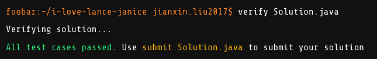
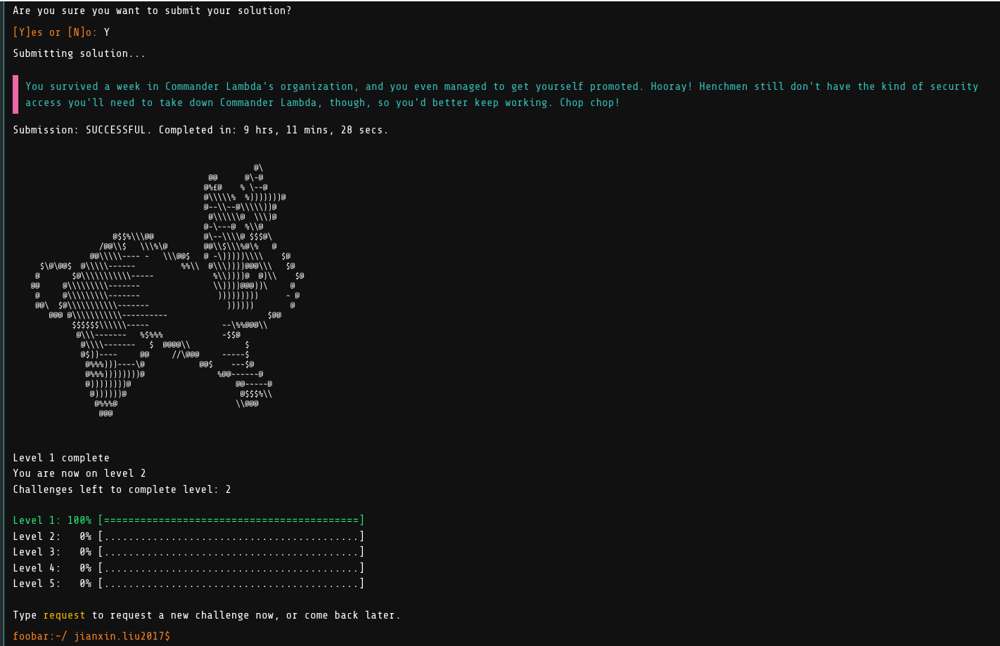

# Google foobar challenge

https://www.kaggle.com/general/168814

https://forketyfork.medium.com/google-foobar-challenge-what-you-should-know-5d4ea34c5960

## level 1

description：

```tx
You've caught two of your fellow minions passing coded notes back and forth -- while they're on duty, no less! Worse, you're pretty sure it's
not job-related -- they're both huge fans of the space soap opera ""Lance & Janice"". You know how much Commander Lambda hates
waste, so if you can prove that these minions are wasting time passing non-job-related notes, it'll put you that much closer to a promotion.

Fortunately for you, the minions aren't exactly advanced cryptographers. In their code, every lowercase letter [a..z] is replaced with the corresponding
one in [z..a], while every other character (including uppercase letters and punctuation) is left untouched.  That is, 'a' becomes 'z',
'b' becomes 'y', 'c' becomes 'x', etc.  For instance, the word ""vmxibkgrlm"", when decoded, would become
""encryption"".

Write a function called solution(s) which takes in a string and returns the deciphered string so you can show the commander proof that these minions are
talking about ""Lance & Janice"" instead of doing their jobs.
```

test cases: 

```txt
Input:
solution.solution("wrw blf hvv ozhg mrtsg'h vkrhlwv?")

Output:
did you see last night's episode?

Input:
solution.solution("Yvzs! I xzm'g yvorvev Lzmxv olhg srh qly zg gsv xlolmb!!")

Output:
Yeah! I can't believe Lance lost his job at the colony!!
```





## level 2

### Elevator Maintenance

description：

```txt
Elevator Maintenance
====================

You've been assigned the onerous task of elevator maintenance -- ugh! It wouldn't be so bad, except that all the elevator documentation has been lying
in a disorganized pile at the bottom of a filing cabinet for years, and you don't even know what elevator version numbers you'll be working on.

Elevator versions are represented by a series of numbers, divided up into major, minor and revision integers. New versions of an elevator increase the major
number, e.g. 1, 2, 3, and so on. When new features are added to an elevator without being a complete new version, a second number named "minor" can
be used to represent those new additions, e.g. 1.0, 1.1, 1.2, etc. Small fixes or maintenance work can be represented by a third number named
"revision", e.g. 1.1.1, 1.1.2, 1.2.0, and so on. The number zero can be used as a major for pre-release versions of elevators, e.g. 0.1, 0.5, 0.9.2,
etc (Commander Lambda is careful to always beta test her new technology, with her loyal henchmen as subjects!).

Given a list of elevator versions represented as strings, write a function solution(l) that returns the same list sorted in ascending order by major, minor,
and revision number so that you can identify the current elevator version. The versions in list l will always contain major numbers, but minor and revision
numbers are optional. If the version contains a revision number, then it will also have a minor number.

For example, given the list l as ["1.1.2", "1.0", "1.3.3", "1.0.12", "1.0.2"], the function solution(l) would
return the list ["1.0", "1.0.2", "1.0.12", "1.1.2", "1.3.3"]. If two or more versions are equivalent but one
version contains more numbers than the others, then these versions must be sorted ascending based on how many numbers they have, e.g ["1",
"1.0", "1.0.0"]. The number of elements in the list l will be at least 1 and will not exceed 100.
```

test cases:

```txt
Input:
Solution.solution({"1.11", "2.0.0", "1.2", "2", "0.1", "1.2.1", "1.1.1",
"2.0"})

Output:
0.1,1.1.1,1.2,1.2.1,1.11,2,2.0,2.0.0

Input:
Solution.solution({"1.1.2", "1.0", "1.3.3", "1.0.12", "1.0.2"})

Output:
1.0,1.0.2,1.0.12,1.1.2,1.3.3
```


### 

description:

```txt
Ion Flux Relabeling
===================

Oh no! Commander Lambda's latest experiment to improve the efficiency of the LAMBCHOP doomsday device has backfired spectacularly. The Commander had been 
improving the structure of the ion flux converter tree, but something went terribly wrong and the flux chains exploded. Some of the ion flux converters 
survived the explosion intact, but others had their position labels blasted off. Commander Lambda is having her henchmen rebuild the ion flux converter tree by 
hand, but you think you can do it much more quickly -- quickly enough, perhaps, to earn a promotion!

Flux chains require perfect binary trees, so Lambda's design arranged the ion flux converters to form one. To label them, Lambda performed a post-order 
traversal of the tree of converters and labeled each converter with the order of that converter in the traversal, starting at 1. For example, a tree of 7 
converters would look like the following:

   7
 3   6
1 2 4 5

Write a function solution(h, q) - where h is the height of the perfect tree of converters and q is a list of positive integers representing different flux 
converters - which returns a list of integers p where each element in p is the label of the converter that sits on top of the respective converter in q, or -1 
if there is no such converter.  For example, solution(3, [1, 4, 7]) would return the converters above the converters at indexes 1, 4, and 7 in a perfect binary 
tree of height 3, which is [3, 6, -1].

The domain of the integer h is 1 <= h <= 30, where h = 1 represents a perfect binary tree containing only the root, h = 2 represents a perfect binary 
tree with the root and two leaf nodes, h = 3 represents a perfect binary tree with the root, two internal nodes and four leaf nodes (like the example above), 
and so forth.  The lists q and p contain at least one but no more than 10000 distinct integers, all of which will be between 1 and 2^h-1, inclusive.
```

test cases:

```txt
Input:
Solution.solution(5, {19, 14, 28})
Output:
    21,15,29

Input:
Solution.solution(3, {7, 3, 5, 1})
Output:
    -1,7,6,3
```